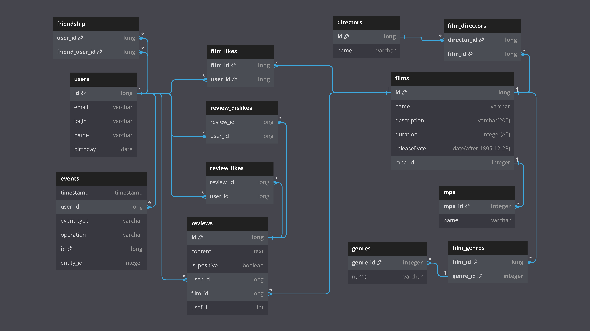

# Filmorate
### Бэкенд сервиса-соцсети для поиска фильмов и сериалов на основе отзывов и оценок пользователей
> ### Технологии:
> ### SpringBoot | Maven | Lombok | JDBC | H2 Database | REST API | JUnit

### Основные объекты взаимодействия
- Фильмы, их режиссеры, жанры и рейтинги возрастных ограничений.
- Отзывы на фильмы с оценками полезности, лайки фильмов.
- Пользователи и лента событий.

### Функционал и команды
**Для управления пользователями доступно:**
- Создать нового пользователя.
- Изменить и удалить существующего пользователя.
- Получить список всех пользователей или конкретного пользователя по его id.
- Добавить и удалить из друзей.
- Получить список друзей конкретного пользователя.
- Получить список общих друзей пользователей.
- Просмотреть ленту новостей на платформе от друзей пользователя: добавление/удаление из друзей, лайки, отзывы.
- Получить рекомендации по фильмам для просмотра.

**Для управления фильмами доступно:**
- Добавить новый фильм.
- Изменить и удалить существующий фильм.
- Получить список всех фильмов или конкретный фильм по id.
- Добавить и удалить лайк у конкретного фильма.
- Получить список популярных фильмов с фильтрацией по жанру и/или году и с возможностью указания их количества.
- Получить список популярных фильмов по ключевым словам в названии и/или режиссеру.
- Получить список фильмов выбранного режиссера, отсортированных по количеству лайков или году выпуска.
- Получить список общих фильмов с выбранным пользователем, отсортированных по популярности.
- Получить список всех жанров фильмов, доступных в сервисе.
- Получить список всех возрастных рейтингов фильмов, доступных в сервисе.


### Взаимосвязи объектов базы данных



**Примеры SQL-запросов:**

<details>
  <summary>Получить пользователя с id = 5 </summary>

```roomsql
SELECT *
FROM users
WHERE id = 5;
```
</details>

<details>
  <summary>Получить список всех друзей пользователя с id = 5 </summary>

```roomsql
SELECT *
FROM users
WHERE id IN 
    (SELECT friend_user_id
    FROM friendship
    WHERE user_id = 5);
```
</details>

<details>
  <summary>Получить фильм с id = 3</summary>

```roomsql
SELECT *
FROM films
WHERE film_id = 3;
```
</details>

<details>
  <summary>Получить ТОП-10 фильмов</summary>

```roomsql
SELECT f.name AS topfilms
FROM films AS f
LEFT JOIN film_likes AS lk ON f.id = lk.film_id
GROUP BY topfilms ORDER BY COUNT(lk.user_id) DESC LIMIT 10;
```
</details>

### Запуск и тестирование приложения
<details>
<summary><b>Запуск приложения</b></summary>

1. Выполните клонирование репозитория:
    - используя web URL: `https://github.com/AlexanderBesedin/java-films.git`
    - используя SSH-ключ: `git@github.com:AlexanderBesedin/java-films.git`
    - или просто скачайте zip-архив 
   по [ссылке](https://github.com/AlexanderBesedin/java-films/archive/refs/heads/main.zip).
2. Запустите файл проекта `FilmorateApplication` в выбранной IDE 
по пути: `src/main/java/ru/yandex/practicum/filmorate/FilmorateApplication.java`.
3. Приложение работает по следующим базовым URL: 
   - `http://localhost:8080/users`.
   - `http://localhost:8080/films`.
   - `http://localhost:8080/reviews`.
   - `http://localhost:8080/directors`.
   - `http://localhost:8080/genres`.
   - `http://localhost:8080/mpa`.
</details>

<details>
<summary><b>Запуск unit-тестов</b></summary>

Используя выбранную IDE, перейдите в директорию `src/test/java/ru/yandex/practicum/filmorate/storage/dao` 
и запустите тесты в классах `FilmDaoImplTest` и `UserDaoImplTest`.
</details>

<details>
<summary><b>Запуск API-тестов</b></summary>

1. Запустите файл проекта `FilmorateApplication` в выбранной IDE 
по пути: `src/main/java/ru/yandex/practicum/filmorate/FilmorateApplication.java`.
2. Импортируйте [json-коллекцию](src/main/resources/testAPI.json) в выбранном вами testAPI-клиенте (*напр. Postman, Insomnia*).
3. Запустите тесты коллекции. При запуске отдельных тестов коллекции учитывайте их порядок вызова 
и результат вызова предыдущих тестов.
</details>

### Статус проекта
На данный момент проект завершен, возможен небольшой рефакторинг методов, структуры для приведения
в соответствие лучшим практикам.